# DASQL Mid-Term
## Assignment 1
Problem Statement-:
>Develop a nutrition tracking system to analyze users' dietary habits and calorie intake. The system should allow users to input their meals, track calorie consumption, and provide insights such as total calorie intake per user, average intake, total intake for each meal type, and identification of users consuming specific food items. The goal is to promote healthier eating habits by providing personalized dietary analysis and feedback.

## User Table
```
CREATE TABLE Users (
UserID INT PRIMARY KEY,
Username VARCHAR(50),
Email VARCHAR(100),
Password VARCHAR(100),
RegistrationDate DATE
);

INSERT INTO Users (UserID, Username, Email, Password, RegistrationDate)
VALUES
(1, 'Rohan', 'rohan@gmail.com', 'password123', '2024-04-01'),
(2, 'Priya', 'priya@gmail.com', 'securepwd', '2024-03-15'),
(3, 'Amit', 'amit@gmail.com', 'strongpassword', '2024-02-20'),
(4, 'Neha', 'neha@gmail.com', 'pass123', '2024-01-10'),
(5, 'Raj', 'raj@gmail.com', 'raj123', '2024-04-05'),
(6, 'Sneha', 'sneha@gmail.com', 'snehapwd', '2024-03-20'),
(7, 'Ankit', 'ankit@gmail.com', 'ankitpass', '2024-02-25'),
(8, 'Pooja', 'pooja@gmail.com', 'poojapwd', '2024-01-05'),
(9, 'Arun', 'arun@gmail.com', 'arun123', '2024-04-10'),
(10, 'Meera', 'meera@gmail.com', 'meera456', '2024-03-25'),
(11, 'Vijay', 'vijay@gmail.com', 'vijaypass', '2024-02-15'),
(12, 'Suman', 'suman@gmail.com', 'sumanpwd', '2024-01-01'),
(13, 'Deepak', 'deepak@gmail.com', 'deepak123', '2024-04-08'),
(14, 'Anjali', 'anjali@gmail.com', 'anjali456', '2024-03-12'),
(15, 'Kiran', 'kiran@gmail.com', 'kiranpass', '2024-02-28');
```
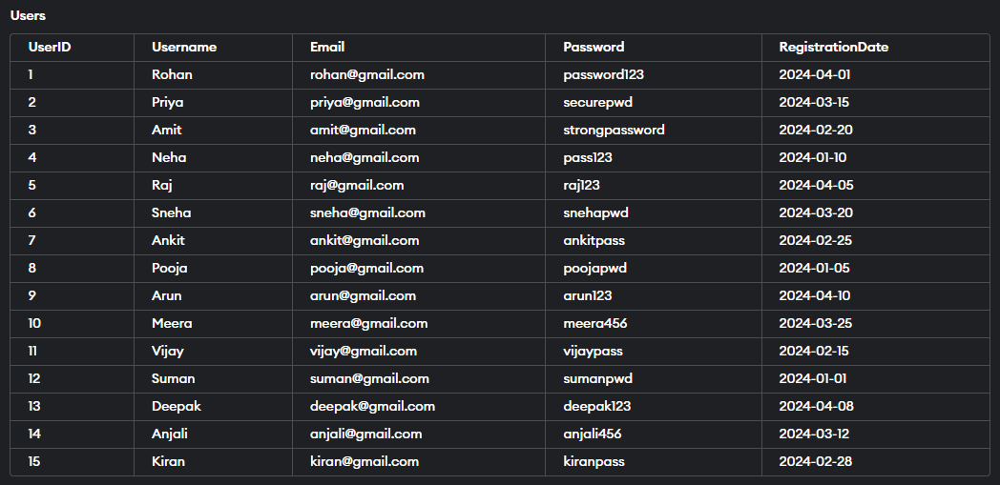

## Workouts Table
```
CREATE TABLE Workouts (
WorkoutID INT PRIMARY KEY,
UserID INT,
WorkoutDate DATE,
WorkoutType VARCHAR(50),
Duration INT,
CaloriesBurned INT,
FOREIGN KEY (UserID) REFERENCES Users(UserID)
);

INSERT INTO Workouts (WorkoutID, UserID, WorkoutDate, WorkoutType, Duration, CaloriesBurned)
VALUES
(1, 1, '2024-04-21', 'Cardio', 60, 400),
(2, 2, '2024-04-20', 'Strength Training', 45, 300),
(3, 3, '2024-04-19', 'Yoga', 30, 200),
(4, 4, '2024-04-18', 'Running', 45, 350),
(5, 5, '2024-04-17', 'HIIT', 40, 380),
(6, 6, '2024-04-16', 'Cycling', 60, 450),
(7, 7, '2024-04-15', 'Swimming', 60, 500),
(8, 8, '2024-04-14', 'Pilates', 45, 320),
(9, 9, '2024-04-13', 'Zumba', 60, 400),
(10, 10, '2024-04-12', 'Crossfit', 60, 450),
(11, 11, '2024-04-11', 'Dance', 60, 380),
(12, 12, '2024-04-10', 'Boxing', 45, 400),
(13, 13, '2024-04-09', 'Walking', 30, 150),
(14, 14, '2024-04-08', 'Calisthenics', 60, 350),
(15, 15, '2024-04-07', 'Piloxing', 45, 400);
```
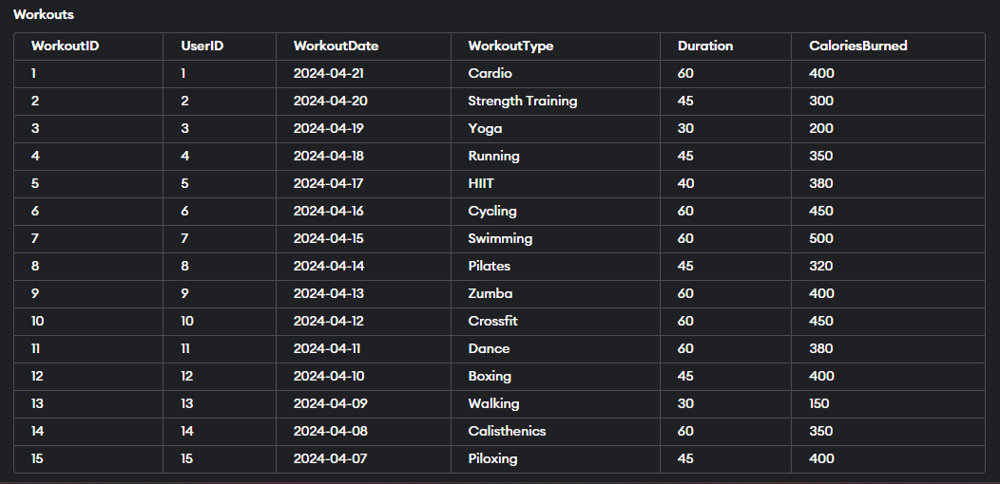
## Excercise Table
```
CREATE TABLE Exercise (
ExerciseID INT PRIMARY KEY,
ExerciseName VARCHAR(100),
Description TEXT,
MuscleGroup VARCHAR(50)
);

INSERT INTO Exercise (ExerciseID, ExerciseName, Description, MuscleGroup)
VALUES
(1, 'Push-ups', 'Strengthens chest, shoulders, and triceps', 'Upper Body'),
(2, 'Squats', 'Strengthens legs and glutes', 'Lower Body'),
(3, 'Plank', 'Core-strengthening exercise', 'Core'),
(4, 'Lunges', 'Strengthens legs and improves balance', 'Lower Body'),
(5, 'Deadlifts', 'Strengthens back, glutes, and hamstrings', 'Lower Body'),
(6, 'Crunches', 'Targets abdominal muscles', 'Core'),
(7, 'Pull-ups', 'Strengthens back and biceps', 'Upper Body'),
(8, 'Burpees', 'Full-body exercise for strength and cardio', 'Full Body'),
(9, 'Russian Twists', 'Targets obliques and improves core stability', 'Core'),
(10, 'Bicep Curls', 'Strengthens biceps', 'Upper Body'),
(11, 'Leg Press', 'Strengthens quadriceps and glutes', 'Lower Body'),
(12, 'Dips', 'Targets triceps and chest', 'Upper Body'),
(13, 'Calf Raises', 'Strengthens calf muscles', 'Lower Body'),
(14, 'Shoulder Press', 'Strengthens shoulders and triceps', 'Upper Body'),
(15, 'Hammer Curls', 'Targets biceps and forearms', 'Upper Body');
```
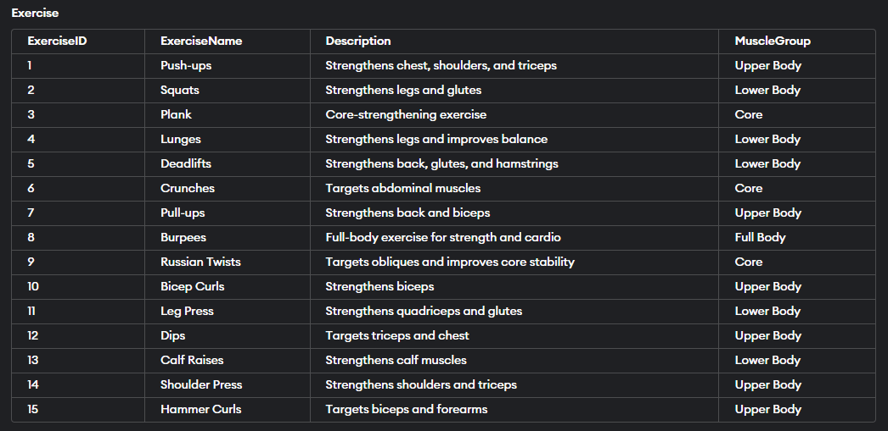
## Nutrition Table
```
CREATE TABLE Nutrition (
NutritionID INT PRIMARY KEY,
UserID INT,
Date DATE,
MealType VARCHAR(50),
FoodItem VARCHAR(100),
Quantity INT,
Calories INT,
FOREIGN KEY (UserID) REFERENCES Users(UserID)
);

INSERT INTO Nutrition (NutritionID, UserID, Date, MealType, FoodItem, Quantity, Calories)
VALUES
(1, 1, '2024-04-21', 'Breakfast', 'Idli', 3, 150),
(2, 2, '2024-04-20', 'Lunch', 'Dal Tadka', 1, 250),
(3, 3, '2024-04-19', 'Dinner', 'Chicken Biryani', 1, 500),
(4, 4, '2024-04-18', 'Snack', 'Paneer Tikka', 6, 300),
(5, 5, '2024-04-17', 'Breakfast', 'Poha', 1, 200),
(6, 6, '2024-04-16', 'Lunch', 'Rajma Chawal', 1, 350),
(7, 7, '2024-04-15', 'Dinner', 'Fish Curry', 1, 400),
(8, 8, '2024-04-14', 'Snack', 'Fruit Salad', 1, 100),
(9, 9, '2024-04-13', 'Breakfast', 'Omelette', 2, 300);
```
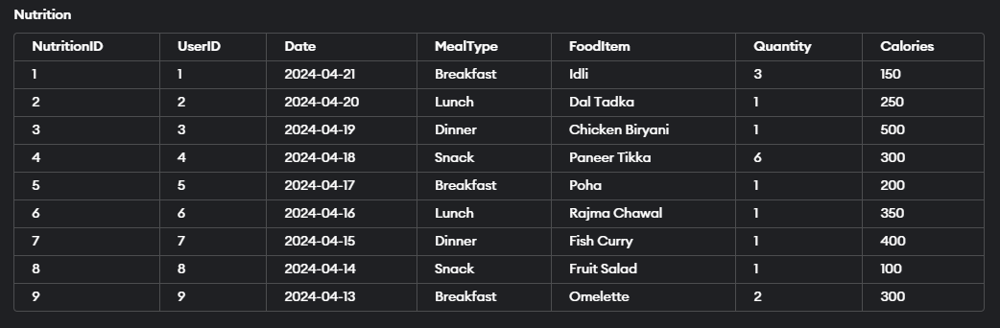
## ER Diagram
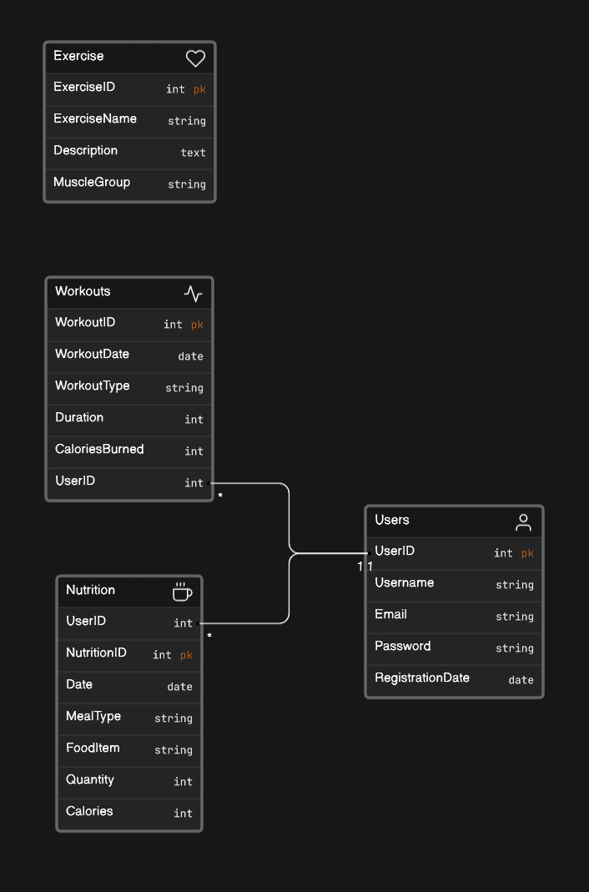
## Assignment 2
30 Questions
>*1-10 Single table Questions
>*11-20 Two Table Questions
>*21-30 Three Table Questions

1. What are the total calories consumed by a particular user on a specific date?
2. Which food items have been consumed the most by users?
3. How many calories have been consumed by all users on a specific date?
4. What is the average calorie intake per meal type for a particular user?
5. Which users have consumed the highest number of calories on a specific date?
6. Which food items have been consumed by a specific user on a particular date?
7. What is the total calorie intake for each user?
8. What is the average calorie intake per user across all dates?
9. Which users have consumed a specific food item?
10. What is the total calorie intake for each meal type?
11. Which users registered between April 1st, 2024, and April 10th, 2024, and which exercise targets the obliques and improves core stability?
12. What is the email address of the user with the username 'Meera' and what is the description of the exercise with ExerciseID 3?
13. Who registered on January 10th, 2024 and which exercise strengthens the legs and glutes?
14. Which users registered in March 2024, and what is the muscle group targeted by the exercise 'Squats'?
15. What is the password of the user with the email 'sneha@gmail.com' and which exercise strengthens the shoulders and triceps?
16. Who is the user with UserID 7 and what is the exercise name with ExerciseID 8?
17. Which users registered after January 1st, 2024 and which exercise targets the back and biceps?
18. What is the registration date of the user with the username 'Vijay' and what is the description of the exercise with ExerciseID 10?
19. Who registered on February 28th, 2024 and what is the exercise name that targets quadriceps and glutes?
20. What are the usernames of users who registered in April 2024 and which exercise strengthens the chest, shoulders, and triceps?
21. What was the workout type, duration, and calorie burn for Rohan's workout on April 21st, 2024?
22. Which user had the longest duration workout on April 16th, 2024, and what was the type of workout? Also, what was the calorie intake of this user on the same day, and what meal did they consume?
23. How many users had a workout session on April 18th, 2024, and what was the total calorie burn of all workouts combined? Additionally, what was the calorie intake of these users on the same day, and what meal did they consume the most?
24. Which user had the highest calorie intake on April 19th, 2024, and what meal did they consume? Also, what was the workout type and duration for this user on the same day, and how many calories did they burn?
25. What was the average duration of workouts for all users on April 14th, 2024? Additionally, what was the total calorie intake of all users on the same day, and what meal did they consume the most?
26. Which user had the highest calorie intake for breakfast on April 21st, 2024, and what food item did they consume? Also, what was the workout type and duration for this user on the same day, and how many calories did they burn?
27. How many users had a workout session on April 12th, 2024, and what was the total duration of all workouts combined? Additionally, what was the calorie intake of these users on the same day, and what meal did they consume the most?
28. What was the total calorie intake of all users on April 15th, 2024, during swimming sessions? Additionally, what was the workout type and duration for users who had a swimming session on the same day, and how many calories did they burn?
29. Which user had the lowest calorie intake on April 20th, 2024, and what meal did they consume? Also, what was the workout type and duration for this user on the same day, and how many calories did they burn?
30. What was the total calorie intake of all users on April 13th, 2024, and what was the most consumed meal type? Additionally, what was the workout type and duration for users who had a workout session on the same day, and how many calories did they burn?

## Assignment 3
>10 Single table Questions-:

Q.1- What are the total calories consumed by a particular user on a specific date?
```
SELECT UserID, Date, SUM(Calories) AS TotalCaloriesConsumed
FROM Nutrition
WHERE UserID = 1
AND Date = '2024-04-21'
GROUP BY UserID, Date;
```

Q.2- Which food items have been consumed the most by users?
```
SELECT FoodItem, SUM(Quantity) AS TotalConsumption
FROM Nutrition
GROUP BY FoodItem
ORDER BY TotalConsumption DESC;
```
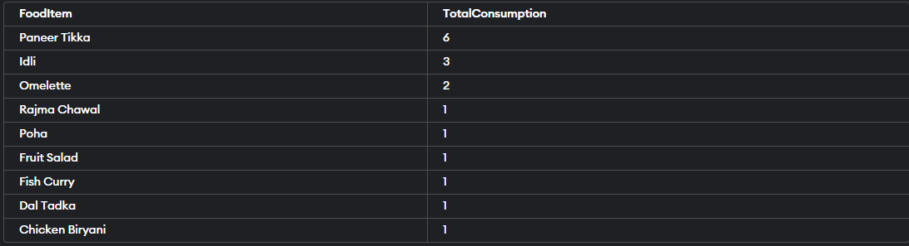
Q.3- How many calories have been consumed by all users on a specific date?
```

SELECT SUM(Calories) AS TotalCaloriesConsumed
FROM Nutrition
WHERE Date = '2024-04-21';
```
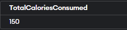

Q.4- What is the average calorie intake per meal type for a particular user?
```
SELECT MealType, AVG(Calories) AS AverageCaloriesPerMeal
FROM Nutrition
WHERE UserID = 7
GROUP BY MealType;
```
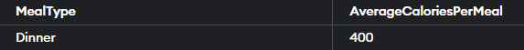

Q.5- Which users have consumed the highest number of calories on a specific date?
```
SELECT UserID, SUM(Calories) AS TotalCaloriesConsumed
FROM Nutrition
WHERE Date = '2024-04-19'
GROUP BY UserID
ORDER BY TotalCaloriesConsumed DESC;
```


Q.6- Which food items have been consumed by a specific user on a particular date?
```
SELECT FoodItem, Quantity, Calories
FROM Nutrition
WHERE UserID = 2 AND Date = '2024-04-20';
```
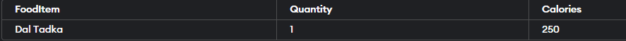

Q.7- What is the total calorie intake for each user?
```
SELECT UserID, SUM(Calories) AS TotalCaloriesConsumed
FROM Nutrition
GROUP BY UserID;
```
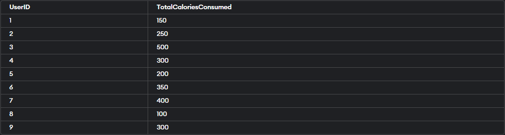

Q.8- What is the average calorie intake per user across all dates?
```
SELECT UserID, AVG(Calories) AS AverageCaloriesIntake
FROM Nutrition
GROUP BY UserID;
```
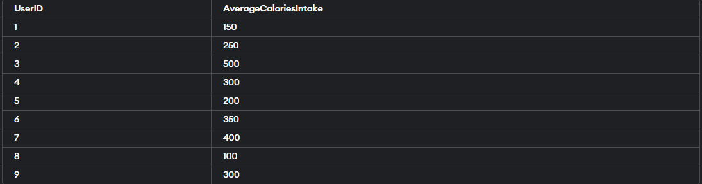

Q.9- Which users have consumed a specific food item?
```
SELECT DISTINCT UserID
FROM Nutrition
WHERE FoodItem = 'Idli';
```


Q.10- What is the total calorie intake for each meal type?
```
SELECT MealType, SUM(Calories) AS TotalCaloriesIntake
FROM Nutrition
GROUP BY MealType;
```
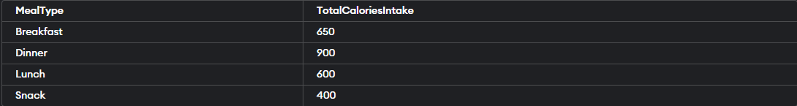

## Assignment 4
>10 Questions on table "Users" and "Exercise" -:

Q.11- Which users registered between April 1st, 2024, and April 10th, 2024, and which exercise targets the obliques and improves core stability?
```
SELECT Users.Username AS RegisteredUser, Exercise.ExerciseName AS TargetedExercise
FROM Users
CROSS JOIN Exercise
WHERE Users.RegistrationDate BETWEEN '2024-04-01' AND '2024-04-10'
AND Exercise.Description LIKE '%obliques%';
```
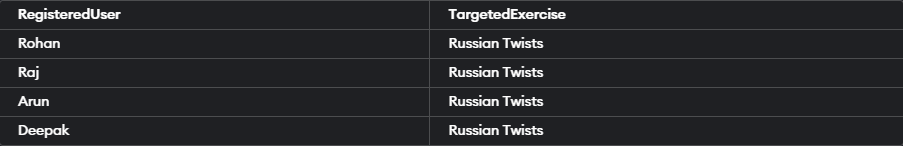

Q.12- What is the email address of the user with the username 'Meera' and what is the description of the exercise with ExerciseID 3?
```
SELECT Users.Email AS UserEmail, Exercise.Description AS ExerciseDescription
FROM Users, Exercise
WHERE Users.Username = 'Meera' AND Exercise.ExerciseID = 3;
```


Q.13- Who registered on January 10th, 2024 and which exercise strengthens the legs and glutes?
```
SELECT Users.Username AS RegisteredUser, Exercise.ExerciseName AS TargetedExercise
FROM Users, Exercise
WHERE Users.RegistrationDate = '2024-01-10' AND Exercise.Description LIKE '%legs%' AND Exercise.Description LIKE '%glutes%';
```


Q.14- Which users registered in March 2024, and what is the muscle group targeted by the exercise 'Squats'?
```
SELECT Users.Username AS RegisteredUser, Exercise.MuscleGroup AS TargetedMuscleGroup
FROM Users
JOIN Exercise ON Users.UserID = Exercise.ExerciseID
WHERE Users.RegistrationDate >= '2024-03-01'
AND Users.RegistrationDate <= '2024-03-31'
AND Exercise.ExerciseName = 'Squats';
```


Q.15- What is the password of the user with the email 'sneha@gmail.com' and which exercise strengthens the shoulders and triceps?
```
SELECT Users.Password AS UserPassword, Exercise.ExerciseName AS TargetedExercise
FROM Users, Exercise
WHERE Users.Email = 'sneha@gmail.com'
AND Exercise.Description LIKE '%shoulders%'
AND Exercise.Description LIKE '%triceps%';
```


Q.16- Who is the user with UserID 7 and what is the exercise name with ExerciseID 8?
```
SELECT Users.Username AS UserWithID7, Exercise.ExerciseName AS ExerciseWithID8
FROM Users, Exercise
WHERE Users.UserID = 7 AND Exercise.ExerciseID = 8;
```


Q.17- Which users registered after January 1st, 2024 and which exercise targets the back and biceps?
```
SELECT Users.Username AS RegisteredUser, Exercise.ExerciseName AS TargetedExercise
FROM Users, Exercise
WHERE Users.RegistrationDate > '2024-01-01'
AND Exercise.Description LIKE '%back%'
AND Exercise.Description LIKE '%biceps%';
```
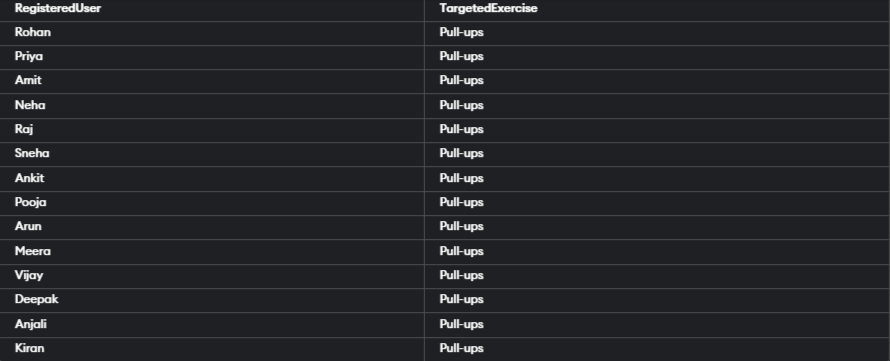

Q.18- What is the registration date of the user with the username 'Vijay' and what is the description of the exercise with ExerciseID 10?
```
SELECT Users.RegistrationDate AS RegistrationDateOfVijay, Exercise.Description AS DescriptionOfExerciseID10
FROM Users, Exercise
WHERE Users.Username = 'Vijay' AND Exercise.ExerciseID = 10;
```


Q.19- Who registered on February 28th, 2024 and what is the exercise name that targets quadriceps and glutes?
```
SELECT Users.Username AS RegisteredUser, Exercise.ExerciseName AS TargetedExercise
FROM Users, Exercise
WHERE Users.RegistrationDate = '2024-02-28'
AND Exercise.Description LIKE '%quadriceps%'
AND Exercise.Description LIKE '%glutes%';
```


Q.20- 10. What are the usernames of users who registered in April 2024 and which exercise strengthens the chest, shoulders, and triceps?
```
SELECT Users.Username AS RegisteredUser, Exercise.ExerciseName AS TargetedExercise
FROM Users, Exercise
WHERE Users.RegistrationDate >= '2024-04-01' AND Users.RegistrationDate <= '2024-04-30'
AND Exercise.Description LIKE '%chest%'
AND Exercise.Description LIKE '%shoulders%'
AND Exercise.Description LIKE '%triceps%';
```
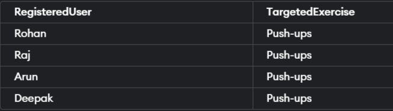

## Assignment 5
>10 Questions on table "Users","Workouts" and "Nutrition -:

Q.21- What was the workout type, duration, and calorie burn for Rohan's workout on April 21st, 2024?
```
SELECT w.WorkoutType, w.Duration, w.CaloriesBurned
FROM Workouts w
JOIN Users u ON w.UserID = u.UserID
WHERE u.Username = 'Rohan' AND w.WorkoutDate = '2024-04-21';
```
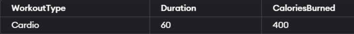

Q.22- Which user had the longest duration workout on April 16th, 2024, and what was the type of workout? Also, what was the calorie intake of this user on the same day, and what meal did they consume?
```
SELECT u.Username, w.WorkoutType, w.Duration, n.MealType, n.FoodItem, n.Calories
FROM Workouts w
JOIN Users u ON w.UserID = u.UserID
JOIN Nutrition n ON u.UserID = n.UserID
WHERE w.WorkoutDate = '2024-04-16'
ORDER BY w.Duration DESC
LIMIT 1;
```


Q.23- How many users had a workout session on April 18th, 2024, and what was the total calorie burn of all workouts combined? Additionally, what was the calorie intake of these users on the same day, and what meal did they consume the most?
```
SELECT COUNT(DISTINCT w.UserID) AS NumUsers, SUM(w.CaloriesBurned) AS TotalCaloriesBurned,
n.MealType, n.FoodItem
FROM Workouts w
JOIN Users u ON w.UserID = u.UserID
JOIN Nutrition n ON u.UserID = n.UserID
WHERE w.WorkoutDate = '2024-04-18'
GROUP BY n.MealType, n.FoodItem
```


Q.24- Which user had the highest calorie intake on April 19th, 2024, and what meal did they consume? Also, what was the workout type and duration for this user on the same day, and how many calories did they burn?
```
SELECT u.Username, n.MealType, n.FoodItem, w.WorkoutType, w.Duration, w.CaloriesBurned
FROM Nutrition n
JOIN Users u ON n.UserID = u.UserID
JOIN Workouts w ON u.UserID = w.UserID
WHERE n.Date = '2024-04-19'
ORDER BY n.Calories DESC
LIMIT 1;
```


Q.25- What was the average duration of workouts for all users on April 14th, 2024? Additionally, what was the total calorie intake of all users on the same day, and what meal did they consume the most?
```
SELECT AVG(Duration) AS AvgDuration, SUM(n.Calories) AS TotalCalories,
n.MealType, n.FoodItem
FROM Workouts w
JOIN Nutrition n ON w.UserID = n.UserID
WHERE w.WorkoutDate = '2024-04-14'
GROUP BY n.MealType, n.FoodItem;
```
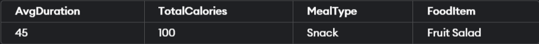

Q.26- Which user had the highest calorie intake for breakfast on April 21st, 2024, and what food item did they consume? Also, what was the workout type and duration for this user on the same day, and how many calories did they burn?
```
SELECT u.Username, n.FoodItem, w.WorkoutType, w.Duration, w.CaloriesBurned
FROM Nutrition n
JOIN Users u ON n.UserID = u.UserID
LEFT JOIN Workouts w ON u.UserID = w.UserID AND n.Date = w.WorkoutDate
WHERE n.Date = '2024-04-21' AND n.MealType = 'Breakfast'
ORDER BY n.Calories DESC
LIMIT 1;
```


Q.27- How many users had a workout session on April 12th, 2024, and what was the total duration of all workouts combined? Additionally, what was the calorie intake of these users on the same day, and what meal did they consume the most?
```
SELECT
COUNT(DISTINCT w.UserID) AS NumUsersWithWorkout,
SUM(w.Duration) AS TotalDurationOfWorkouts,
n.MealType AS MostConsumedMealType,
n.FoodItem AS MostConsumedFoodItem
FROM
Workouts w
LEFT JOIN
Nutrition n ON w.UserID = n.UserID AND w.WorkoutDate = n.Date
WHERE
w.WorkoutDate = '2024-04-12'
GROUP BY
n.MealType, n.FoodItem;
```
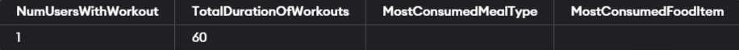

Q.28-  What was the total calorie intake of all users on April 15th, 2024, during swimming sessions? Additionally, what was the workout type and duration for users who had a swimming session on the same day, and how many calories did they burn?

```
SELECT SUM(n.Calories) AS TotalCalories, w.WorkoutType, w.Duration, w.CaloriesBurned
FROM Workouts w
JOIN Nutrition n ON w.UserID = n.UserID
WHERE w.WorkoutDate = '2024-04-15' AND w.WorkoutType = 'Swimming';
```
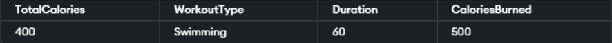

Q.29- Which user had the lowest calorie intake on April 20th, 2024, and what meal did they consume? Also, what was the workout type and duration for this user on the same day, and how many calories did they burn?
```
SELECT u.Username, n.FoodItem, w.WorkoutType, w.Duration, w.CaloriesBurned
FROM Nutrition n
JOIN Users u ON n.UserID = u.UserID
LEFT JOIN Workouts w ON u.UserID = w.UserID AND n.Date = w.WorkoutDate
WHERE n.Date = '2024-04-20'
ORDER BY n.Calories ASC
LIMIT 1;
```
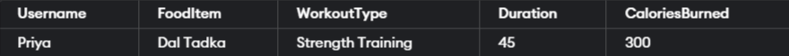

Q.30- What was the total calorie intake of all users on April 13th, 2024, and what was the most consumed meal type? Additionally, what was the workout type and duration for users who had a workout session on the same day, and how many calories did they burn?
```

SELECT SUM(n.Calories) AS TotalCalories, n.MealType AS MostConsumedMealType,
w.WorkoutType, w.Duration, w.CaloriesBurned
FROM Nutrition n
JOIN Users u ON n.UserID = u.UserID
LEFT JOIN Workouts w ON u.UserID = w.UserID AND n.Date = w.WorkoutDate
WHERE n.Date = '2024-04-13'
GROUP BY n.MealType, w.WorkoutType, w.Duration, w.CaloriesBurned;
```
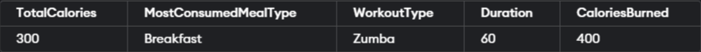

## Assignment 6
### Summary

**Users Table:** 
> Contains information about users including UserID, Username, Email, Password, and RegistrationDate.

**Workouts Table:**
>Stores data about workouts performed by users, including WorkoutID, UserID, WorkoutDate, WorkoutType, Duration, and CaloriesBurned.
It has a foreign key constraint referencing the UserID in the Users table.

**Exercise Table:**
>Holds details about different exercises, including ExerciseID, ExerciseName, Description, and MuscleGroup.

**Nutrition Table:**
>Stores information about the nutrition intake of users, including NutritionID, UserID, Date, MealType, FoodItem, Quantity, and Calories.
It has a foreign key constraint referencing the UserID in the Users table.

**Queries:**
>The queries provided cover various aspects such as:
Analyzing total calorie consumption by users on specific dates.
Identifying the most consumed food items and meal types.
Calculating total calories consumed by all users on specific dates.
Determining average calorie intake per meal type for a specific user.
Finding users with the highest calorie intake on specific dates.
Exploring user registrations within certain date ranges and the associated exercises.
Extracting specific information such as email addresses, passwords, and exercise descriptions based on user or exercise attributes.
Analyzing workout details such as type, duration, and calorie burn.
Combining workout and nutrition data to analyze user activity and dietary habits on particular dates.

**Overall:**
>The provided schema and queries allow for a comprehensive analysis of user activities, workouts, dietary habits, and exercise details.
They enable insights into individual user behaviors as well as trends across the user base over specific time periods.


